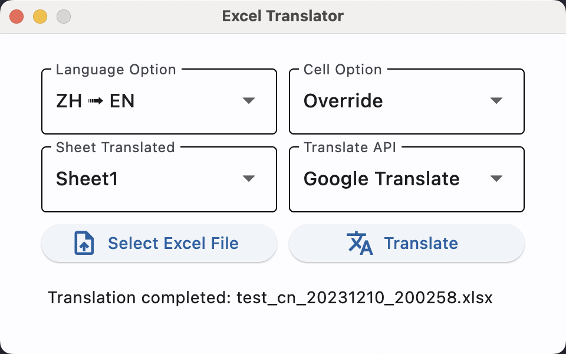
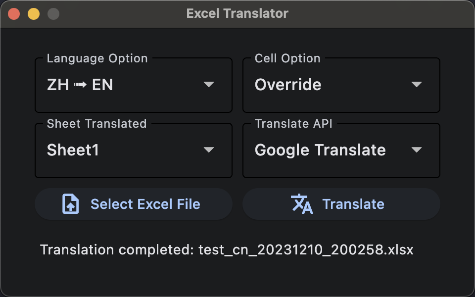

# Excel-trans

`python 3.11` with `Flet`

Etranslate Excel files and keep the original cell format.

## What's it looking like?

## How to use?

Download binary from release or clone this repository run with python.
